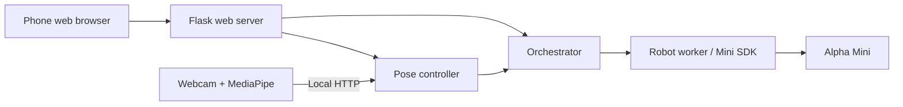

# AlphaMini Assistant

**Phone-based robot control and camera-driven pose mirroring for the UBTECH Alpha Mini.**

AlphaMini Assistant brings a Flask control panel and a MediaPipe vision client together through a single robot SDK connection. Built for interactive demonstrations and campus club events, it supports choreographed routines, movement, speech, and pose-triggered actions.

## Features

- **Mobile control panel:** open the local URL or scan the terminal QR code to access PHASES, ACTIONS, MOVE, SPEAK, and MIMIC controls.
- **Pose mirroring:** recognize Neutral, Arms Up, Wave, and Bow with a laptop webcam and trigger mapped robot actions.
- **Shared command coordination:** manual web controls take priority over pose commands through shared busy-state checks.
- **Tracking-loss handling:** a server-side watchdog requests a neutral action when pose updates stop.
- **Reset and idle:** stop a routine, disable mirroring, and request a neutral robot state from the web panel.
- **Separate vision process:** keep camera dependencies isolated from the AlphaMini SDK.

## Architecture



`main.py` starts the server, orchestrator, and pose watchdog. `pose_client.py` runs separately and sends pose labels to `/pose/relay`; it does not import the robot SDK. Mirroring triggers named actions rather than reproducing human joint angles continuously.

## Requirements

- An Alpha Mini robot with compatible firmware and SDK connectivity.
- A laptop with a webcam for pose recognition.
- Python 3.9 for the original project setup; newer Python versions have not been validated here.
- A trusted local network reachable by the laptop, robot, and phone.

### Why two environments?

The server pins `protobuf==3.20.3` for SDK compatibility, while the pinned MediaPipe vision stack requires a newer protobuf version. Install the two requirements files into **separate virtual environments**.

## Quick start

Clone this repository and open two terminals in its directory.

### 1. Set up the robot server

```bash
python3.9 -m venv .venv-server
```

Activate the environment:

| Platform | Command |
| --- | --- |
| macOS / Linux | `source .venv-server/bin/activate` |
| Windows PowerShell | `.venv-server\Scripts\Activate.ps1` |

```bash
python -m pip install -r requirements.txt
```

Edit `main.py` to set your robot serial or discovery name:

```python
ROBOT_SERIALS = ["YOUR_ROBOT_SERIAL"]
```

Start the server:

```bash
python main.py --no-tunnel
```

Open the printed LAN URL on your phone, or scan the QR code. The default port is **5050**.

### 2. Set up pose recognition

In a second terminal:

```bash
python3.9 -m venv .venv-vision
```

| Platform | Command |
| --- | --- |
| macOS / Linux | `source .venv-vision/bin/activate` |
| Windows PowerShell | `.venv-vision\Scripts\Activate.ps1` |

```bash
python -m pip install -r requirements-vision.txt
python pose_client.py --server http://127.0.0.1:5050
```

Press **s** in the camera window, or use the web panel's MIMIC tab, to enable mirroring.

## Controls and configuration

| Control | Behavior |
| --- | --- |
| `s` in camera window | Toggle pose mirroring |
| `n` in camera window | Request the neutral action |
| `q` in camera window | Close the vision client |
| `q` + Enter or Ctrl+C in server terminal | Shut down the server and release the robot session |
| RESET & IDLE in web panel | Stop the active phase, disable mirroring, and request idle |

| Option | Purpose |
| --- | --- |
| `python main.py --no-tunnel --no-pose` | Run the web controls without pose mirroring |
| `python main.py --no-tunnel --pose-demo` | Log pose actions instead of sending them; the server still initializes the robot worker and web controls remain active |
| `python main.py --no-tunnel --connect-timeout 60` | Allow a longer robot connection wait |
| `python pose_client.py --camera 1` | Select a different webcam |
| `python pose_client.py --demo` | Run camera detection without server calls |

Configure named pose actions near the top of `pose_controller.py`:

| Pose | Default action |
| --- | --- |
| Neutral | `009` |
| Arms Up | `arms_up` |
| Wave | `Surveillance_003` |
| Bow | `bow_avatar` |

**`arms_up` is an unverified custom action name.** Confirm all mappings against your robot firmware before a live demonstration. Default pose limits are 5 commands per second, a 2-second repeat interval, and a 0.75-second tracking-loss timeout; see `Config` in `pose_controller.py`.

The Flask session secret is generated on startup. Set the optional `FLASK_SECRET_KEY` environment variable if a stable secret is needed; keep it out of version control. This secret does not add login or access control.

## Operating limits

The web server has **no authentication** and enables cross-origin requests. Anyone able to reach it can send robot commands. Use the documented `--no-tunnel` mode on a trusted network; public hosting of this source code does not require exposing a running robot server.

The optional tunnel implementation expects a separately supplied `cloudflared.exe` in the working directory and can expose control endpoints publicly. It is not included in this repository. Do not expose the server to an untrusted network without adding authentication and suitable access controls.

Keep the robot on a stable surface with room to move and supervise demonstrations. Reset/idle and tracking-loss actions are software requests, not a hardware emergency-stop guarantee.

## Repository layout

| File | Responsibility |
| --- | --- |
| `main.py` | Startup, robot configuration, QR output, shutdown |
| `webserver.py` | Flask routes, embedded web UI, routine runners |
| `orchestrator.py` | Worker lifecycle and shared command coordination |
| `robot_worker.py` | AlphaMini SDK communication |
| `actions.py` | Action catalog and command construction |
| `content_filter.py` | Text-to-speech content filtering |
| `pose_controller.py` | Pose mapping, gating, and tracking watchdog |
| `pose_client.py` | Webcam capture, MediaPipe classification, HTTP relay |
| `requirements.txt` | Server dependencies |
| `requirements-vision.txt` | Vision dependencies |

## Troubleshooting

- **Protobuf descriptor or MediaPipe graph errors:** recreate the affected environment and install only its matching requirements file.
- **Robot remains at Searching:** verify its serial, power and connectivity; power-cycle it if a previous session was not released.
- **Camera unavailable:** close other camera applications or try `--camera 1`.
- **A pose does not move the robot:** inspect server logs and verify that the mapped action exists on the robot.
- **Missing `mini` or `mediapipe`:** check which environment is active.
- **SDK websocket errors:** preserve the server's `websockets==10.4` pin.

## Development

Python source syntax can be checked without connecting a robot:

```bash
python -m compileall -q main.py webserver.py orchestrator.py robot_worker.py actions.py content_filter.py pose_controller.py pose_client.py
```

Hardware, camera, and end-to-end behavior must be validated in the two configured environments. Syntax validation alone does not establish SDK or firmware compatibility.

See [CONTRIBUTING.md](CONTRIBUTING.md) for contribution guidance.

## License

No open-source license has been selected for this repository. Public availability alone does not grant a general license to reuse, modify, or redistribute the code. Third-party dependencies retain their respective licenses.
